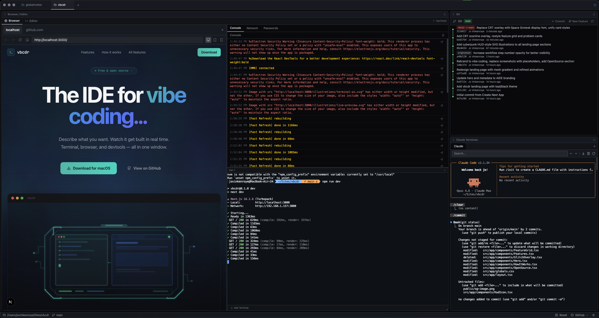

# VibeCoder

**An AIDE for developers who vibe**

A desktop environment built around terminal AI agents, not traditional code editing

## What is an AIDE?

AIDE stands for AI-Integrated Development Environment

Traditional IDEs put the code editor front and center
VibeCoder flips that — terminals and browser previews take the main stage, because in a vibe coding workflow the AI writes the code and you steer, review, and test

The editor is still there when you need to peek at something, but it's intentionally secondary

## Screenshots




## Features

- **Multi-project workspace** — switch between projects in one click, all state travels with you (terminals, browser tabs, file tree)
- **Terminal-first layout** — large dedicated terminal panel with multiple tabs per project, WebGL rendering, search
- **Integrated browser** — per-project browser tabs for localhost, dashboards, docs — with device mode, console, and network panels
- **Code editor** — Monaco editor available when you need it, intentionally secondary
- **Git visualization** — commit graph with branch lanes
- **Light/dark theme** — GitHub-inspired editor themes that match the app

## Tech Stack

- Electron + React + TypeScript
- Zustand for per-project state management
- Monaco Editor, Xterm.js (WebGL), react-resizable-panels
- node-pty for native terminal processes

## Getting Started

```
npm install
npm run dev
```
