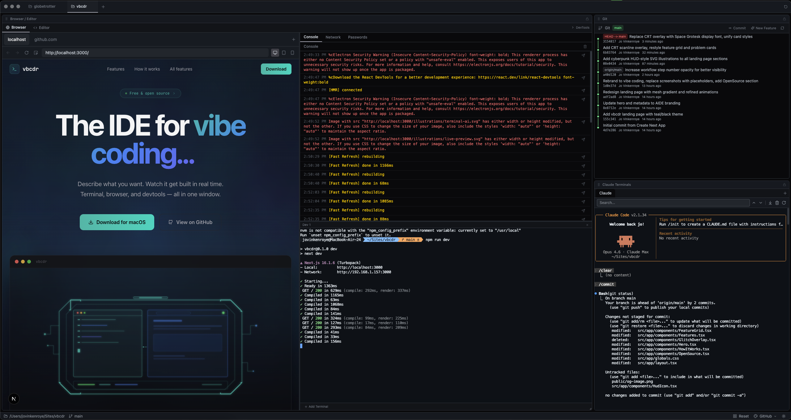
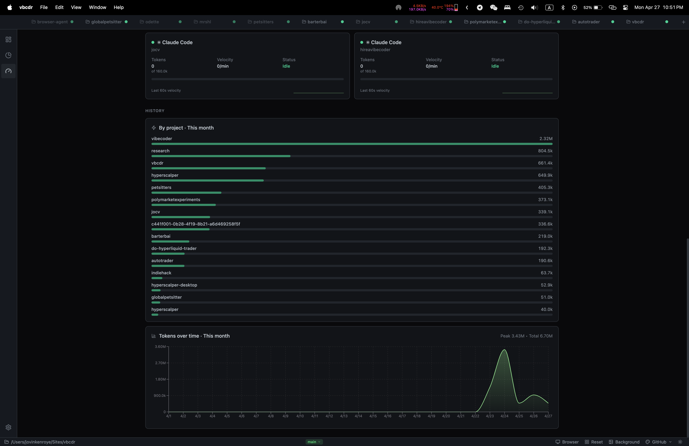
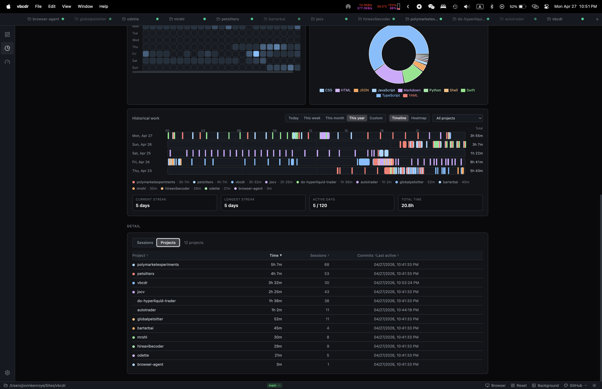
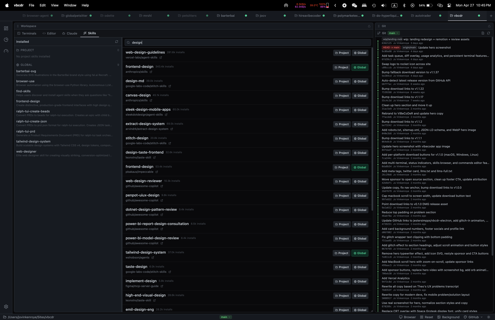
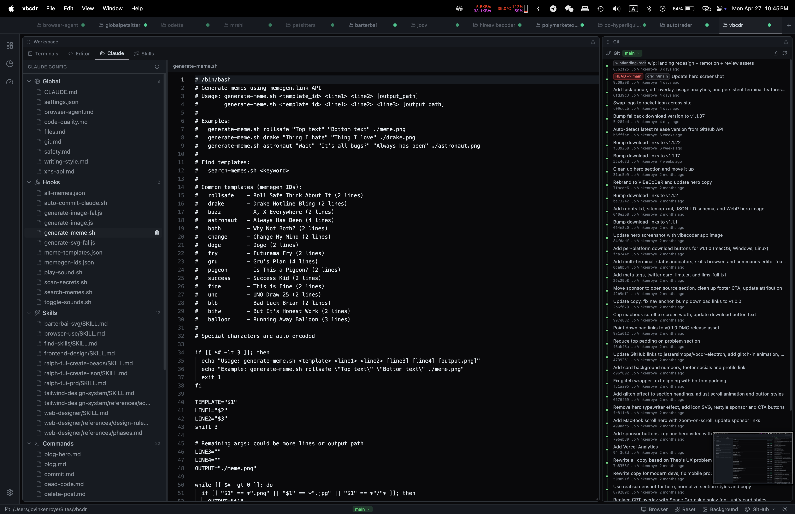
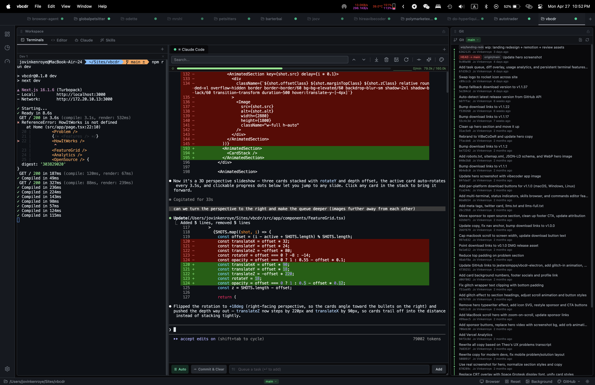
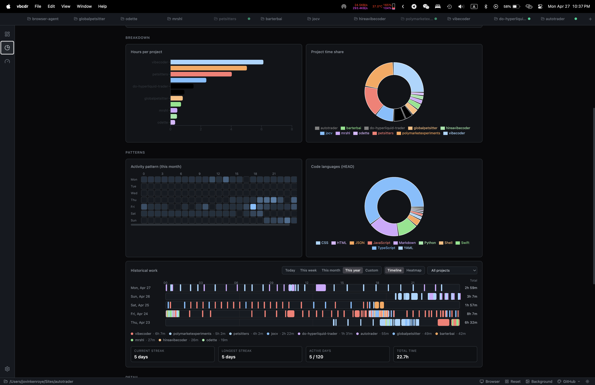

# vbcdr — the first AIDE

[](https://github.com/jestersimpps/vbcdr-electron/actions/workflows/build.yml)

**An AIDE for developers who vibe**

A desktop environment built around terminal AI agents, not traditional code editing

**Download at [vbcdr.io](https://www.vbcdr.io/)**

## What is an AIDE?

AIDE stands for AI-Integrated Development Environment

Traditional IDEs put the code editor front and center
vbcdr flips that — terminals and browser previews take the main stage, because in a vibe coding workflow the AI writes the code and you steer, review, and test

The editor is still there when you need to peek at something, but it's intentionally secondary

## Screenshots















## Features

- **Multi-project workspace** — switch between projects in one click, all state travels with you (terminals, browser tabs, file tree)
- **Terminal-first layout** — large dedicated terminal panel with multiple tabs per project, WebGL rendering, search, busy/idle status indicators, and dynamic tab labels that reflect Claude Code's current state (Claude Code is the default LLM coding agent)
- **Browserless mode** — per-project toggle to merge terminals into the main panel as tabs (Terminals/Editor/Claude) when you don't need the browser
- **Integrated browser** — per-project browser tabs for localhost, dashboards, docs — with device mode, console, network panels, history, bookmarks, zoom, find-in-page, and tab drag-and-drop
- **Token velocity dashboard** — per-project token usage history, active-day tracking, and a sortable analytics table across all projects
- **Activity feed** — live stream of file changes, commands, and diffs surfaced after each terminal action
- **Inline diff overlay** — see a diff of every change made by the LLM right after each terminal command
- **Skills marketplace** — browse and install Claude Code skills with per-scope (project/user) install buttons
- **Custom commands editor** — author and manage slash commands scoped per project or globally, directly in the UI
- **Code editor** — Monaco editor available when you need it, intentionally secondary
- **Claude config editor** — edit Claude Code configuration directly from the UI
- **Git visualization** — commit graph with branch lanes
- **11 themes with dark/light variants** — GitHub, Dracula, Catppuccin, Nord, Monokai, Gruvbox, Tokyo Night, One Dark Pro, Material, Pastel, Psychedelic — with a built-in theme picker
- **Device emulation** — preview your app in mobile and tablet viewports directly in the browser panel
- **Network inspector** — expandable request details with headers, type, accurate response sizes, and response body viewer
- **Send to LLM** — one-click send console errors/warnings and network failures straight to the active LLM coding terminal for instant debugging
- **File drag-and-drop** — drag files into terminals for quick context; images are auto-attached to the LLM via clipboard
- **Shift+Enter newlines** — insert newlines in LLM coding terminal input without submitting
- **Terminal search** — search highlights, clear/restart buttons, scroll-to-bottom, and tooltips on all controls
- **Persistent terminals** — tabs and scrollback survive app restarts, even after a reboot

## Tech Stack

- Electron + React + TypeScript
- Zustand for per-project state management
- Monaco Editor, Xterm.js (WebGL), react-resizable-panels
- node-pty for native terminal processes

## Getting Started

```
npm install
npm run dev
```

Run the test suite:

```
npm test
```

## Still on the roadmap

- **Password manager** — the current password storage system needs a redesign for better UX and reliability
- Click files and folders in the project tree to send to the LLM for easy context input
- Give the LLM access to the webview browser so it can manipulate and test the preview
- Many more ideas

