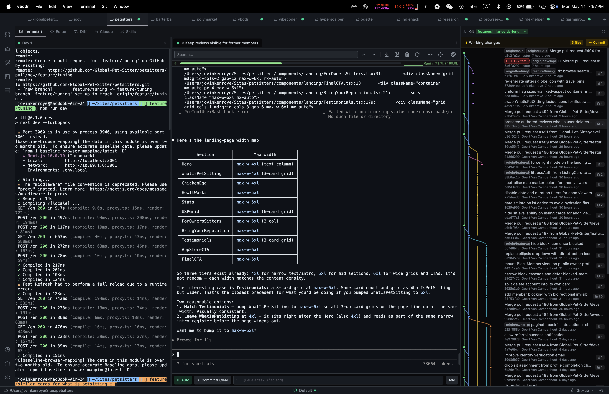
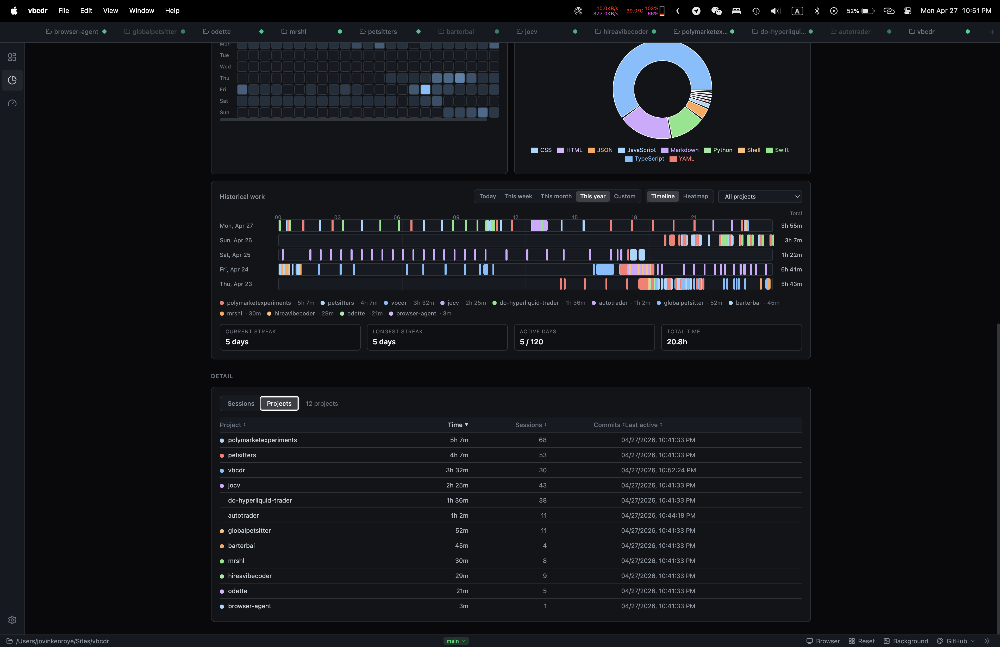

# vbcdr — the first AIDE

[](https://github.com/jestersimpps/vbcdr-electron/actions/workflows/build.yml)

**An AIDE for developers who vibe**

A desktop environment built around terminal AI agents, not traditional code editing

**Download at [vbcdr.io](https://www.vbcdr.io/)**

## What is an AIDE?

AIDE stands for AI-Integrated Development Environment

Traditional IDEs put the code editor front and center
vbcdr flips that — terminals take the main stage, because in a vibe coding workflow the AI writes the code and you steer, review, and test

The editor is still there when you need to peek at something, but it's intentionally secondary

One window per project. Each project owns its own terminal stack, layout, git graph, and slice of the analytics

## Screenshots





## Which agent?

The terminals are agent-agnostic. The LLM startup command is configurable, so Claude Code, Codex, or any other TUI coding agent runs in them as a first-class citizen

Some integrations are genuinely Claude Code-specific — the skills page, the `~/.claude` config editor, dynamic tab labels, and permission presets. Codex gets token usage read from its own rollout files. Anything else runs under "Other" with a custom command

## Features

### Workspace

- **Multi-project dashboard** — switch between projects in one click, all state travels with you (terminals, file tree, queues, splits)
- **Project cards with modal** — open any project in a focused modal with its own embedded terminal
- **Command palette** — fuzzy finder for projects, terminals, files, themes, settings, and actions
- **File tree** — hides gitignored files by default, with context menu and drag-and-drop into terminals
- **Project switcher** with async tree loading and cache for fast first-time opens

### Terminals (the main stage)

- **Multiple terminals per project** with WebGL rendering, search, and scrollback persistence across app restarts
- **LLM terminal + dev terminals** — a dedicated panel for the LLM coding agent and a separate panel for dev terminals
- **Dynamic tab labels** that reflect Claude Code's current state, with busy/idle status indicators
- **Permissions presets** — switch between read-only / auto-accept / yolo modes per terminal with a single button
- **Task queue panel** — line up prompts and feed them to the LLM terminal one by one, auto-running when the agent goes idle
- **Shift+Enter newlines** — insert newlines in LLM coding terminal input without submitting (kitty keyboard protocol)
- **File drag-and-drop** into terminals for quick context; images auto-attach via clipboard
- **Idle sound** — optional notification sound when the LLM goes idle
- **Configurable LLM startup command** — defaults to `claude`, swap in Codex or any CLI agent

### Worktrees

- **Worktree-backed LLM tabs** — each new LLM tab can get its own git worktree and branch under `.worktrees/`, so parallel tabs never touch each other's changes
- **Close-tab workflow** — a configurable instruction runs when you close a worktree tab, then the worktree is cleaned up
- **PR panel** — tracked worktrees with PR state badges, conflict counts, and a one-click "fix conflicts" handoff back into a terminal

### Claude Code integration

- **Claude config editor** — edit `~/.claude` settings, CLAUDE.md files, and global config directly from the UI
- **Skills page** — browse and install Claude Code skills with per-scope (project/user) install buttons
- **MCP page** — add, edit, and remove MCP servers across user/project/local scopes, with connection health and auth status
- **Activity feed** — live stream of file changes and commands surfaced after each terminal action
- **Token velocity dashboard** — per-project token usage history, active-day tracking, sortable analytics table across all projects
- **Token cap** with per-project sparkline

### Editor & git

- **Monaco editor** — available when you need it, intentionally secondary; binary preview for non-text files
- **Editor power-ups** — drag-to-reorder tabs, git-status colors, format-on-save, debounced autosave, minimap toggle
- **Git tree** — commit graph with branch lanes, branch switcher, drift banner, conflict banner, diff panel
- **AI code review** — Functional / Technical / Deep modes annotate the diff with inline comments pinned to the right line. Functional = plain-language for non-developers, Technical = design choices & trade-offs for another dev, Deep = line-by-line *why*. Includes a comment tour (Play/Prev/Next, `[` `]` shortcuts) that walks you through every annotation
- **Dev server scanner** — list of running dev servers across the system with port, PID, uptime, CPU, memory, and a kill button

### Statistics

- **Time analytics** — hours per project, project time share, activity heatmap, streaks, and totals
- **Token analytics** — velocity sparkline, persisted history, sortable Sessions and Projects tables
- **Theme-aware charts** with a Commits / Terminal / Both source toggle

### Voice & companion

- **Voice control** — talk to the agent: local VAD and transcription, configurable silence threshold, and a confirm step before destructive commands
- **Companion** — an animated 3D character below the git panel that reacts to what the agent is doing, reading the terminal buffer for tool calls, failures, and completions. Optional Edge TTS speech. Every line is attributed to the project that produced it

### Polish

- **18 themes** with dark/light variants — vbcdr, GitHub, One Dark Pro, Dracula, Material, Nord, Tokyo Night, Catppuccin, Pastel, Gruvbox, Monokai, Psychedelic, Synthwave, Cyberpunk, Rainbow, Tropical, Afternoon — plus a custom theme editor
- **Auto-updater** with update banner
- **Persistent terminals** — tabs and scrollback survive app restarts, even after a reboot

## Tech Stack

- Electron + React + TypeScript
- Zustand for per-project state management
- Monaco Editor, Xterm.js (WebGL), react-resizable-panels
- node-pty for native terminal processes
- three.js + @pixiv/three-vrm for the companion
- chokidar for file watching, recharts for token usage charts

## Getting Started

```
npm install
npm run dev
```

Run the test suite:

```
npm test
```

Build a distributable:

```
npm run build:mac      # macOS arm64 dmg + zip
npm run build:linux    # Linux AppImage + deb
npm run build:win      # Windows NSIS installer
```

## License

GNU Affero General Public License v3.0 or later — see [LICENSE](LICENSE)

If you run a modified version of vbcdr as a network service, the AGPL requires you to offer its source to the users of that service
